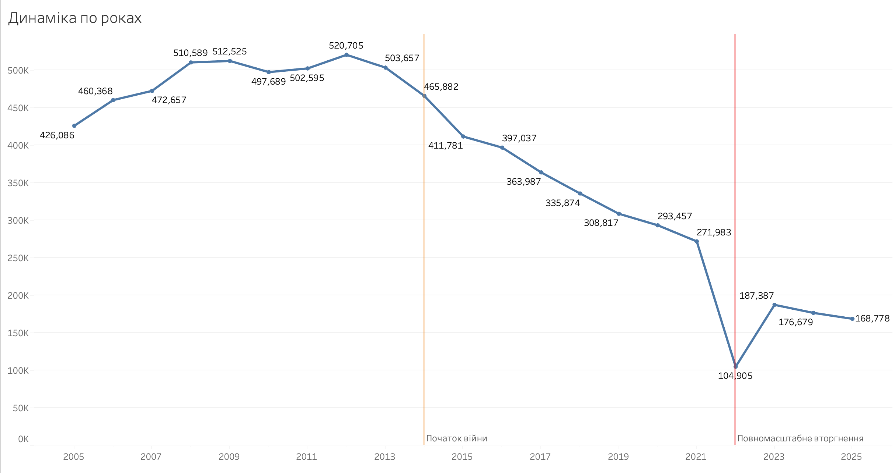
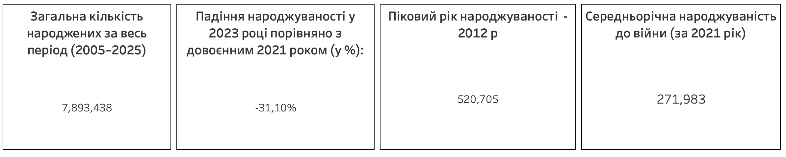
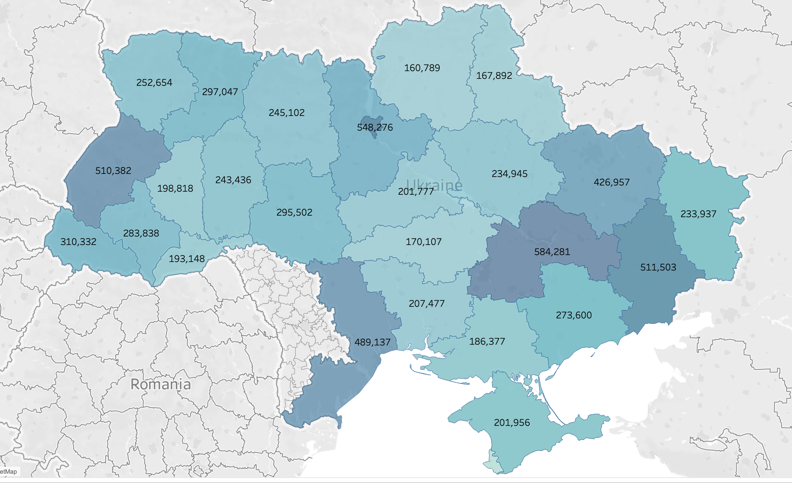

#  Аналіз динаміки народжуваності в Україні (2005–2025 рр.)

## Про проєкт

Проєкт присвячений аналізу довгострокових регіональних трендів народжуваності в Україні та оцінці демографічного впливу повномасштабної війни на основі офіційних даних Державної служби статистики України та оперативних даних Міністерства юстиції.

### Мета дослідження
Проаналізувати відмінності у кількості живонароджених в Україні залежно від територіального розрізу та типу місцевості у динаміці по роках. Виявити ключові демографічні тренди з особливим фокусом на зміну тенденцій після 2022 року, щоб оцінити вплив повномасштабної війни, міграційних процесів та тимчасової окупації територій на рівень народжуваності.

### Гіпотези та виклики дослідження
* **Вплив повномасштабної війни (з 2022 року):** Очікується найстрімкіше падіння кількості зареєстрованих живонароджених за весь період незалежності. Це зумовлено комплексом факторів: безпековими ризиками, масовою міграцією жінок репродуктивного віку за кордон, а також фізичною відсутністю статистичних даних з тимчасово окупованих територій.
* ** Важливо (Особливості даних):** Дані Державної служби статистики України за певні роки наведені без урахування тимчасово окупованих територій (АР Крим, місто Севастополь та частини тимчасово окупованих областей). Тому різке зниження абсолютних показників народжуваності відображає не лише реальне падіння демографії, а й фізичну неможливість збору статистичних даних на цих територіях.

🔗 **Інтерактивний дашборд на Tableau Public:** [https://public.tableau.com/views/Book2_17874920789070/Dashboard1?:language=en-US&:sid=&:redirect=auth&:display_count=n&:origin=viz_share_link]

---

## 1. Загальна динаміка та тренди

Проаналізовано динаміку народжуваності в Україні по 25 регіонах (24 області + м. Київ) за 2005–2025 роки. Повномасштабне вторгнення 2022 року стало переломним моментом. До вторгнення спостерігалася циклічність із піком у 2012 році (520,705 новонароджених) та подальшим плавним структурним спадом.

---

## 2. Основні результати та ключові висновки

###  Кризовий шок 2022–2023 років
* **Стрімке падіння:** Скорочення народжуваності у 2023 році на **-31.10%** порівняно з довоєнним 2021 роком (зниження з 271,983 до 187,387 та подальше вирівнювання).

### Аналіз артефактів даних (2022–2023 рр.)
На графіку помітна важлива аномалія: у 2022 році лінія різко падає до ~100К, а у 2023 році спостерігається «відскік» вгору до ~187К. Це не помилка, а цінний артефакт даних:
1. **Збій реєстрації:** У 2022 році через початок вторгнення державні реєстри в багатьох регіонах тимчасово не працювали.
2. **Зовнішня міграція:** Мільйони жінок виїхали за кордон і народжували там, тому ці діти не потрапили в українську статистику одразу.
3. **Стабілізація системи:** У 2023 році робота реєстрів стабілізувалася, і цифри почали відображати більш повну картину.

###  Регіональний розподіл
Найбільшу демографічну базу традиційно формують великі міста та густонаселені регіони (м. Київ, Дніпропетровська, Львівська та Одеська області). Інтерактивна карта на дашборді дозволяє детально відстежити зміни по кожній області окремо.

---

## Інструменти та стек

* **Tableau Public** (розробка дашборду, інтерактивні фільтри, KPI-картки, розрахункові поля / LOD-вирази)
* **PostgreSQL / SQL** (трансформація та об'єднання даних через `UNION ALL`)
* **Очищення даних** (нормалізація назв регіонів, усунення зірочок та статистичних виносок через `REPLACE`)
* **Географічний мапінг та аналіз**
